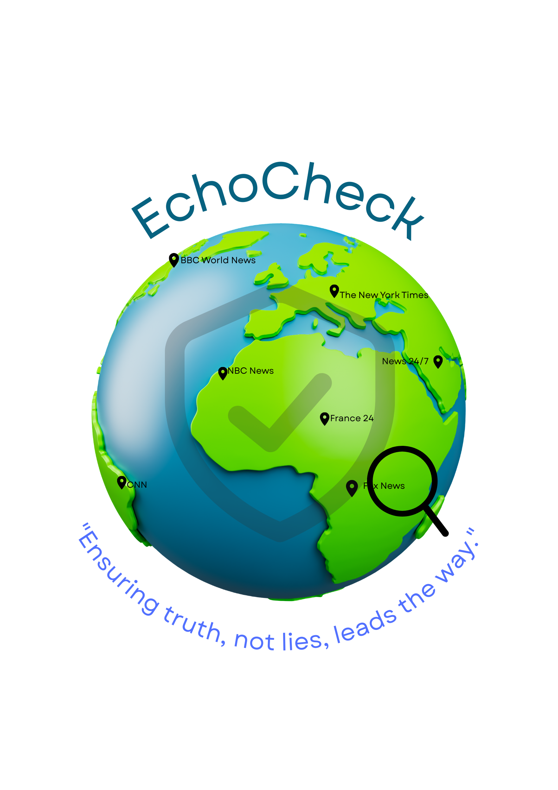

<p align="center">
  
</p>

<h1 align="center">EchoCheck</h1>

<p align="center">
  <em>A Multi-Stage Retrieval-Augmented Generation (RAG) Framework for Real-Time Misinformation Detection and Source Credibility Analysis</em>
</p>

<p align="center">
  
  
  
  
  
</p>

---

## Abstract

The proliferation of misinformation across digital platforms has created an urgent need for automated, evidence-grounded verification systems. **EchoCheck** addresses this challenge by implementing a **multi-stage Retrieval-Augmented Generation (RAG) pipeline** that combines real-time web retrieval, heuristic pre-filtering, large language model reasoning, and media bias estimation into a unified fact-verification framework.

Unlike conventional fact-checkers that rely on static databases or singular model inference, EchoCheck dynamically retrieves live evidence at query time, grounds its analysis exclusively in retrieved context, and provides transparent source-level bias classification — enabling users to assess not just *what* the verdict is, but *how trustworthy the underlying sources are*.

<p align="center">
  
</p>

---

## Key Contributions

- **Evidence-Grounded Verification Pipeline** — A multi-stage architecture that enforces strict evidence grounding, preventing hallucinated or knowledge-cutoff-dependent verdicts
- **Heuristic Pre-Filtering Layer** — A rule-based sanity check module that intercepts fundamentally false claims before invoking external APIs, reducing latency and cost
- **Real-Time Retrieval Integration** — Live web search at inference time ensures verdicts reflect the most current information available, not stale training data
- **Source Credibility & Bias Analysis** — Automated political bias estimation (Left-leaning / Center / Right-leaning) per evidence source, visualized for end-user transparency
- **Resilient Multi-Model Inference** — Automatic failover across multiple LLM endpoints to maintain service availability under rate-limiting conditions
- **Dual-Layer Persistence** — Cloud-first storage with automatic local fallback, ensuring zero data loss across connectivity states

---

## System Architecture

```
                          ┌──────────────────────┐
                          │     User Interface    │
                          │  (Glassmorphic Chat)  │
                          └──────────┬───────────┘
                                     │ POST /analyze
                                     ▼
┌────────────────────────────────────────────────────────────────┐
│                    EchoCheck RAG Pipeline                       │
│                                                                │
│  ┌─────────────────┐     ┌──────────────────┐                  │
│  │  STAGE 1         │     │  STAGE 2          │                 │
│  │  Heuristic       │────▶│  Real-Time        │                 │
│  │  Pre-Filter      │     │  Web Retrieval    │                 │
│  │                  │     │  (SerpAPI)        │                 │
│  │  Rule-based      │     │                   │                 │
│  │  sanity check    │     │  Top-k organic    │                 │
│  │  for impossible  │     │  results fetched  │                 │
│  │  claims          │     │  at query time    │                 │
│  └─────────────────┘     └────────┬─────────┘                  │
│                                    │                            │
│                                    ▼                            │
│  ┌─────────────────────────────────────────────────────┐       │
│  │  STAGE 3: Evidence-Grounded LLM Analysis             │       │
│  │                                                      │       │
│  │  • Statement + retrieved evidence → structured prompt│       │
│  │  • Strict JSON output: verdict, reasoning, evidence  │       │
│  │  • Per-source political bias classification          │       │
│  │  • Multi-model failover (4 model cascade)            │       │
│  └─────────────────────────────────────────────────────┘       │
│                                                                │
└────────────────────────────────────────────────────────────────┘
                                     │
                                     ▼
                    ┌────────────────────────────────┐
                    │  Response: Verdict + Evidence   │
                    │  + Bias Analysis + Source URLs  │
                    └────────────────────────────────┘
```

---

## Features

| Module | Description |
|--------|-------------|
| **Heuristic Pre-Filter** | Keyword-based detection of fundamentally impossible claims, bypassing expensive API calls for obvious misinformation |
| **Real-Time Retrieval Engine** | Live Google search integration via SerpAPI, ensuring evidence reflects current events rather than static training data |
| **RAG-Based Verdict Generation** | Claims are analyzed *exclusively* against retrieved evidence — the model is explicitly instructed to disregard internal knowledge, minimizing hallucination |
| **Source Bias Classifier** | Each evidence source is classified along a political spectrum (Left / Center / Right), giving users visibility into potential editorial slant |
| **Multi-Model Cascade** | Automatic failover across 4 LLM endpoints (Gemini 2.0 Flash → 2.5 Flash → 2.0 Flash-Lite → 2.5 Flash-Lite) for high availability |
| **Interactive Bias Visualization** | Doughnut chart with contextual descriptions of each bias category for user education |
| **Secure Authentication** | Firebase Authentication with email/password, per-user data isolation |
| **Dual-Layer Persistence** | Cloud Firestore as primary store, localStorage as automatic fallback — ensures chat history is never lost |
| **Responsive Glassmorphic UI** | Mobile-first design with frosted-glass aesthetics, smooth animations, and dark-mode-ready styling |

---

## Technology Stack

| Layer | Technology | Purpose |
|-------|-----------|---------|
| **Backend** | Python 3.10+, Flask | REST API server, pipeline orchestration |
| **Retrieval** | SerpAPI | Real-time Google Search for evidence gathering |
| **Inference** | Google Gemini API (multi-model) | Evidence-grounded claim analysis with structured JSON output |
| **Authentication** | Firebase Auth | Secure user account management |
| **Database** | Cloud Firestore + localStorage | Dual-layer chat history persistence |
| **Frontend** | HTML5, Vanilla JS, Tailwind CSS | Responsive chat interface |
| **Visualization** | Chart.js | Source bias distribution chart |

---

## Getting Started

### Prerequisites

- Python 3.10+
- [SerpAPI](https://serpapi.com/) API key
- [Google Gemini](https://aistudio.google.com/apikey) API key
- [Firebase](https://console.firebase.google.com/) project (Authentication + Firestore enabled)

### Installation

```bash
# Clone the repository
git clone https://github.com/AKESH11/EchoCheck.git
cd EchoCheck

# Install dependencies
pip install flask flask-cors requests google-search-results
```

### Configuration

**1. Set API keys** (environment variables recommended):

```bash
# Linux / macOS
export SERPAPI_API_KEY=your_key_here
export GEMINI_API_KEY=your_key_here

# Windows PowerShell
$env:SERPAPI_API_KEY = "your_key_here"
$env:GEMINI_API_KEY = "your_key_here"
```

**2. Firebase setup** — Update the `firebaseConfig` object in `script.js` with your Firebase project credentials.

**3. Firestore security rules** — In Firebase Console → Firestore → Rules:

```
rules_version = '2';
service cloud.firestore {
  match /databases/{database}/documents {
    match /users/{userId}/chats/{chatId} {
      allow read, write: if request.auth != null && request.auth.uid == userId;
    }
  }
}
```

### Running

```bash
python EchoCheck.py
```

Open `index.html` in your browser. The backend runs on `http://127.0.0.1:5000`.

---

## API Reference

### `GET /`

Health check.

```json
{ "status": "ok", "message": "EchoCheck RAG Server is running." }
```

### `POST /analyze`

Submit a claim for multi-stage verification.

**Request:**
```json
{ "statement": "The Eiffel Tower is located in Berlin" }
```

**Response:**
```json
{
  "verdict": "Debunked",
  "reasoning": "Multiple authoritative sources confirm the Eiffel Tower is located in Paris, France, not Berlin.",
  "evidence": [
    {
      "title": "Eiffel Tower - Wikipedia",
      "source": "Wikipedia",
      "snippet": "The Eiffel Tower is a wrought-iron lattice tower on the Champ de Mars in Paris, France...",
      "bias": "Center",
      "url": "https://en.wikipedia.org/wiki/Eiffel_Tower"
    }
  ]
}
```

**Verdict taxonomy:** `Confirmed` · `Debunked` · `Complex/Mixed` · `Inconclusive` · `Fundamentally False`

---

## Verification Pipeline — Detailed Flow

| Stage | Module | Input | Output | Fallback |
|-------|--------|-------|--------|----------|
| **1** | Heuristic Pre-Filter | Raw claim | Pass / Reject with reason | — |
| **2** | Real-Time Retrieval | Claim as search query | Top-k Google results | Returns "Inconclusive" if no results |
| **3** | RAG Analysis | Claim + evidence context | Structured verdict JSON | Cascades through 4 models on rate-limit |
| **4** | Bias Classification | Evidence sources | Per-source bias label | Included in Stage 3 prompt |
| **5** | Persistence | Full result | Firestore document | localStorage fallback |

---

## Project Structure

```
EchoCheck/
├── EchoCheck.py        # Backend — RAG pipeline, multi-model inference, API routes
├── index.html          # Frontend — Auth screens, chat interface, responsive layout
├── script.js           # Frontend — Authentication, chat logic, history, bias rendering
├── style.css           # Frontend — Glassmorphic theme, animations, responsive design
├── EchoCheck.png       # Brand asset — Logo
├── EchoCheck1.png      # Brand asset — Interface screenshot
├── EcoCheck.pptx       # Project presentation
├── .gitignore          # Git ignore rules
└── README.md           # Documentation (this file)
```

---

## Limitations & Future Work

- **Bias classification** is currently LLM-estimated; future iterations will incorporate established media bias datasets (e.g., AllSides, MBFC)
- **Evidence retrieval** is limited to Google organic results; planned expansion to include academic databases and official government sources
- **Multilingual support** is not yet implemented
- **Claim decomposition** for complex multi-part statements is planned for the next release

---

## Contributing

1. Fork the repository
2. Create a feature branch (`git checkout -b feature/your-feature`)
3. Commit changes (`git commit -m 'Add feature'`)
4. Push to branch (`git push origin feature/your-feature`)
5. Open a Pull Request

---

## License

This project is open source and available under the [MIT License](LICENSE).

---

<p align="center">
  Built by <a href="https://github.com/AKESH11"><strong>AKESH</strong></a>
</p>
